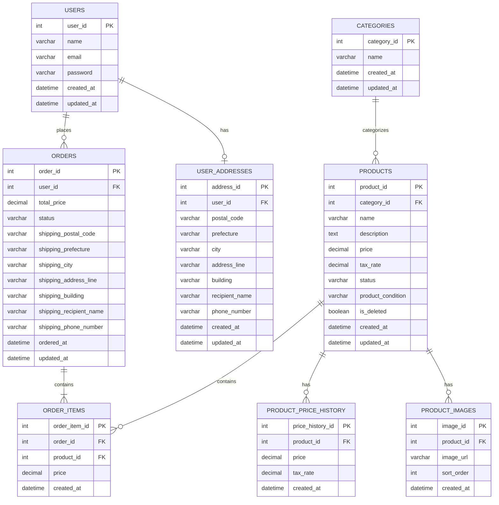

```mermaid
erDiagram

    USERS ||--o| USER_ADDRESSES : has
    USERS ||--o{ ORDERS : places

    CATEGORIES ||--o{ PRODUCTS : categorizes

    PRODUCTS ||--o{ PRODUCT_IMAGES : has
    PRODUCTS ||--o{ PRODUCT_PRICE_HISTORY : has
    PRODUCTS ||--o{ ORDER_ITEMS : contains

    ORDERS ||--|{ ORDER_ITEMS : contains


    USERS {
        int user_id PK
        varchar name
        varchar email
        varchar password
        datetime created_at
        datetime updated_at
    }

    USER_ADDRESSES {
        int address_id PK
        int user_id FK
        varchar postal_code
        varchar prefecture
        varchar city
        varchar address_line
        varchar building
        varchar recipient_name
        varchar phone_number
        datetime created_at
        datetime updated_at
    }

    CATEGORIES {
        int category_id PK
        varchar name
        datetime created_at
        datetime updated_at
    }

    PRODUCTS {
        int product_id PK
        int category_id FK
        varchar name
        text description
        decimal price
        decimal tax_rate
        varchar status
        varchar product_condition
        boolean is_deleted
        datetime created_at
        datetime updated_at
    }

    PRODUCT_IMAGES {
        int image_id PK
        int product_id FK
        varchar image_url
        int sort_order
        datetime created_at
    }

    PRODUCT_PRICE_HISTORY {
        int price_history_id PK
        int product_id FK
        decimal price
        decimal tax_rate
        datetime created_at
    }

    ORDERS {
        int order_id PK
        int user_id FK
        decimal total_price
        varchar status
        varchar shipping_postal_code
        varchar shipping_prefecture
        varchar shipping_city
        varchar shipping_address_line
        varchar shipping_building
        varchar shipping_recipient_name
        varchar shipping_phone_number
        datetime ordered_at
        datetime updated_at
    }

    ORDER_ITEMS {
        int order_item_id PK
        int order_id FK
        int product_id FK
        decimal price
        datetime created_at
    }
```